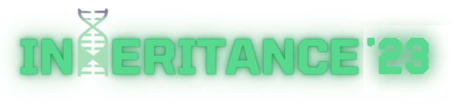

<h1 align="center">
  
   
  
</h1>

<h1 align = "center" > <strong>NonStop Lofi Vibe Generator</strong>  </h1>

<h3 align = "center">

 :notes: Generating Nonstop original Lofi-Music :notes:

[COC](https://github.com/CommunityOfCoders/Inheritance-2023) Inheritance 2023 </h3>

Table of Contents

- [Description](#description)
- [Links](#links)
- [Tech Stack](#tech-stack)
- [Progress](#progress)
- [Future Scope](#future-scope)
- [Applications](#applications)
- [Project Setup](#project-setup)
- [Usage](#usage)
- [Team Members](#team-members)
- [Mentors](#mentors)
- [Screenshots](#screenshots)

## 📝Description

Our project is an interactive web application that allows users to generate original Lofi music, play nonstop piano music, and experience music with visuals. The application integrates advanced machine learning models to provide a unique and immersive musical experience.

Key Features:

> Lofi Music Generation:

- Users can generate original Lofi music using Variational Autoencoders (VAEs) through a latent space.The generated Lofi music is unique to each user session, providing endless possibilities for exploration and creativity.

> Nonstop Piano Music Playback:

- Users can enjoy nonstop piano music playback generated using Long Short-Term Memory (LSTM) networks.
  
> Music Experience with Visuals:
- The music experience page offers users the opportunity to immerse themselves in music accompanied by captivating visuals. The visuals are synchronized with the music, enhancing the overall listening experience. Users can choose from a variety of visual themes and effects to accompany the music, creating a visually stunning and dynamic environment.

## 🔗Links

- [GitHub Repository](https://github.com/AryanNanda17/NonStop-Lofi-Vibe-Generator)
- [Demo Video]()
- [Drive Link to Screenshots of your project]()
- [Hosted Website Link]()
- [App APK Link]()
- [Hosted Backend Link]()

Add any more links/resources you used for your project

## 🤖Tech-Stack

#### Front-end
- HTML
- CSS
- JavaScript
- etc.

#### Back-end
- NodeJS
- ExpressJS
- etc.

#### Database
- MongoDB
- SQL
- etc.

#### Computer Vision
- OpenCV
- etc.

## 📈Progress

List down all the fully implemented features in your project

- [x] Original Lofi Music Generation. 
- [x] Nonstop Music Generatioin(Piano).
- [x] Music Experience.  

## 🔮Future Scope

List down all the future plans for the project here

- Mood Based Lofi Music Generation
- Nonstop Lofi Music Generation
- Text Based Lofi Music Generation. 

## 💸Applications

>While the project may not directly solve a real-time problem in the traditional sense, it addresses several needs and desires that individuals may have in their daily lives:
- Research in Generative AI.
- Creativity and Inspiration
- Relaxation and Stress Relief
- Entertainment and Enjoyment

## 🛠Project Setup

## 💻Usage

## 👨‍💻Team Members

Add names of your team members with their emails and links to their GitHub accounts

- [Param Thakkar](https://github.com/ParamThakkar123): paramthakkar864@gmail.com
- [Aryan Nanda(https://github.com/AryanNanda17): nandaaryan823@gmail.com
- [Mohammed](https://github.com/mohammed052): mhdbhadsorawala@gmail.com
- [Kamakshi](https://github.com/Kamakshi8104): kamakshiramamurthy8104@gmail.com

## 👨‍🏫Mentors

Add names of your mentors with their emails and links to their GitHub accounts

- [Pranav Janjalani]([https://github.com/](https://github.com/pranavjanjani)): janjanipranav@gmail.com
- [Dhruvil](https://github.com/): Email 

## 📱Screenshots
Add a few screenshots for parts of the project completed till now to give the viewer a quick idea of what your project looks like. After all, a picture speaks a thousand words.

You'll have to link the screenshots from your drive folder here.

