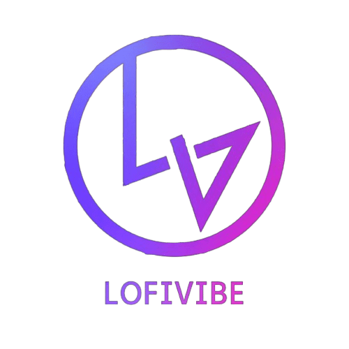

<h1 align = "center"> <strong>NonStop Lofi Vibe Generator</strong></h1>

<h3 align = "center">

 :notes: Generating original Lofi-Music :notes:

[COC](https://github.com/CommunityOfCoders/Inheritance-2023) Inheritance 2023</h3>

Table of Contents

- [Description](#description)
- [Links](#links)
- [Tech Stack](#tech-stack)
- [Progress](#progress)
- [Future Scope](#future-scope)
- [Applications](#applications)
- [Project Setup](#project-setup)
- [Usage](#usage)
- [Team Members](#team-members)
- [Mentors](#mentors)
- [Screenshots](#screenshots)

## 📝Description

Our project is an interactive web application that allows users to generate original Lofi music, play nonstop piano music, and experience music with visuals. The application integrates advanced machine learning models to provide a unique and immersive musical experience.

Key Features:

1. Lofi Music Generation:

- Users can generate original Lofi music using Variational Autoencoders (VAEs) through a latent space.The generated Lofi music is unique to each user session, providing endless possibilities for exploration and creativity.

2. Nonstop Piano Music Playback:

- Users can enjoy nonstop piano music playback generated using Long Short-Term Memory (LSTM) networks.
  
3. Music Experience with Visuals:
- The music experience page offers users the opportunity to immerse themselves in music accompanied by captivating visuals. The visuals are synchronized with the music, enhancing the overall listening experience. Users can choose from a variety of visual themes and effects to accompany the music, creating a visually stunning and dynamic environment.

## 🔗Links

- [GitHub Repository](https://github.com/AryanNanda17/NonStop-Lofi-Vibe-Generator)
- [Demo Video]()
- [Drive Link to Screenshots of your project](https://drive.google.com/drive/folders/1AHaIHaLNDvLkIRUy3oYPlDZVcoim2EqJ?usp=sharing)
- [Hosted Website Link]()
- [Hosted Backend Link]()

## 🤖Tech-Stack

#### Front-end
- 
-  
- 
- 
- 
#### Back-end

- 
- 
- 
- 
- 

#### Database
- 

#### DL Framework

- 
- 
- 
- 
- 

## 📈Progress

List down all the fully implemented features in your project

- [x] Original Lofi Music Generation. 
- [x] Nonstop Music Generatioin(Piano).
- [x] Music Experience.  

## 🔮Future Scope

List down all the future plans for the project here

- Mood Based Lofi Music Generation
- Nonstop Lofi Music Generation
- Text Based Lofi Music Generation. 

## 💸Applications

> This project comes under Generative AI category and contributes to the Research in Gen AI in music Generation. The main applications of this projects are:-
- Research in Generative AI.
- Creativity and Inspiration
- Relaxation and Stress Relief
- Entertainment and Enjoyment

## 🛠Project Setup
#### Steps for installation
- Install Node.js
- download git bash
- clone this repository
- git clone <url of this repo>
- open terminal inside this folder
- type npm install
- then npm run dev

## 💻Usage

## 👨‍💻Team Members

- [Param Thakkar](https://github.com/ParamThakkar123): paramthakkar864@gmail.com
- [Aryan Nanda](https://github.com/AryanNanda17): nandaaryan823@gmail.com
- [Mohammed](https://github.com/mohammed052): mhdbhadsorawala@gmail.com
- [Kamakshi](https://github.com/Kamakshi8104): kamakshiramamurthy8104@gmail.com

## 👨‍🏫Mentors

- [Pranav Janjani](https://github.com/pranavjanjani): janjanipranav@gmail.com
- [Dhruvil Suthar](https://github.com/Bruhbytes): dtsuthar6@gmail.com

## 📱Screenshots

## Contributing
Contributions are what make the open-source community such an amazing place to learn, inspire, and create. Any contributions you make are greatly appreciated.

If you have a suggestion that would make this better, please fork the repo and create a pull request. You can also simply open an issue with the tag "enhancement".

1. Fork the Project
2. Create your Feature Branch (`git checkout -b feature/AmazingFeature`)
3. Commit your Changes (`git commit -m 'Add some AmazingFeature'`)
4. Push to the Branch (`git push origin feature/AmazingFeature`)
5. Open a Pull Request
